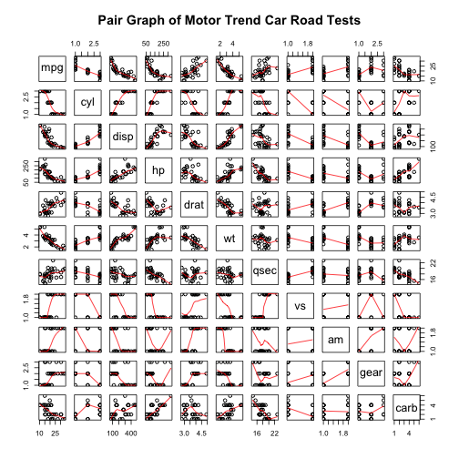
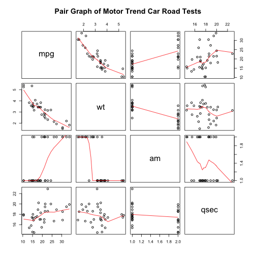
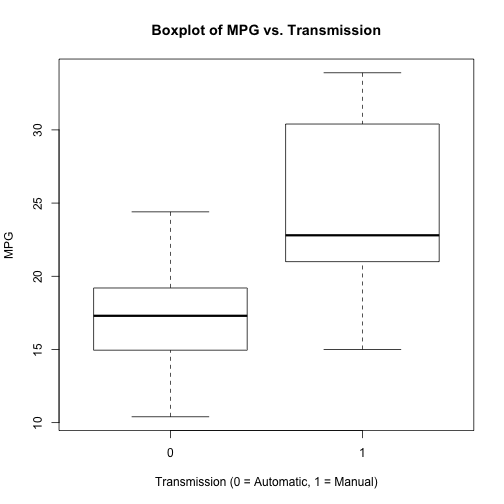
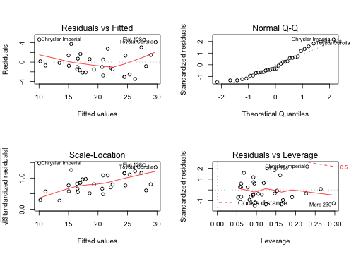

## Executive summary
In this report, we will analyze `mtcars` data set and explore the relationship between a set of available variables and miles per gallon (MPG). The data was extracted from the 1974 *Motor Trend* US magazine, and comprises fuel consumption and 10 aspects of automobile design and performance for 32 automobiles (1973–74 models).
There are 2 main questions to consider: what type of transmission is better for mpg, and how it can be discribed in numeric terms. 
The t-test shows that mpg performance difference between cars with automatic and manual transmission. And it is about 7 MPG more for cars with manual transmission than those with automatic transmission. 
We fit several linear regression models and select the one with highest Adjusted R-squared value. Given model shows that cars that are lighter in weight with a manual transmission and cars that are heavier in weight with an automatic transmission will have higher MPG values.


## Contex
You work for Motor Trend, a magazine about the automobile industry. Looking at a data set of a collection of cars, they are interested in exploring the relationship between a set of variables and miles per gallon (MPG) (outcome). They are particularly interested in the following two questions:

* Is an automatic or manual transmission better for MPG
* Quantify the MPG difference between automatic and manual transmissions


Since p-Value is 0.0013736 the automatic and manual transmissions are from different populations. And the mean for MPG of manual transmitted cars is about 7.2449393 more than that of automatic transmitted cars.  

## Regression Model
Testing simple model.

```r
simpleMpgModel <- lm(mpg~am, data=mtcars)
summary(simpleMpgModel) # results="hide"
```
Simple model can explain 34% of variance of MPG. Adjusted R-squared value indicates that we need to add other variables to the model to make better predictions.

### Finding proper set of explanation variables
Let's test full model.

```r
fullModel <- lm(mpg~.,data=mtcars)
summary(fullModel) # results="hide"
```
Full regression model can explain 78% of MPG variance, but none of the coeficients are significant.
We could find more effective set of variables to explain mpg.


```r
stepModel <- step(fullModel, k=log(nrow(mtcars)))
summary(stepModel) # results="hide"
mpgModel <- lm(mpg~wt+qsec+am, data=mtcars)
```
Linear model mpg ~ wt + qsec + am - 1 explains 83% of MPG variance, but consists only significant at 5% s.l. coefficients. 


```r
anova(mpgModel, simpleMpgModel) 
```

```
## Analysis of Variance Table
## 
## Model 1: mpg ~ wt + qsec + am
## Model 2: mpg ~ am
##   Res.Df    RSS Df Sum of Sq      F   Pr(>F)    
## 1     28 169.29                                 
## 2     30 720.90 -2   -551.61 45.618 1.55e-09 ***
## ---
## Signif. codes:  0 '***' 0.001 '**' 0.01 '*' 0.05 '.' 0.1 ' ' 1
```

```r
confint(mpgModel)
```

```
##                   2.5 %    97.5 %
## (Intercept) -4.63829946 23.873860
## wt          -5.37333423 -2.459673
## qsec         0.63457320  1.817199
## am1          0.04573031  5.825944
```

The measure of how much an observation has effected the estimate of a regression coefficient, we get 1
Therefore, the above analyses meet all basic assumptions of linear regression and well answer the questions.  

## Appendix: Figures  
1. Full Pair Graph

 

2. Selected Dimensions Pair Graph

 

3. Box Plot

 

4. Residual Plots

 
