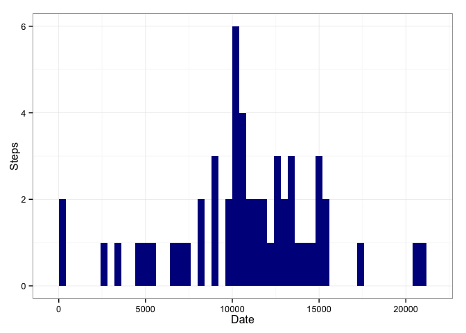
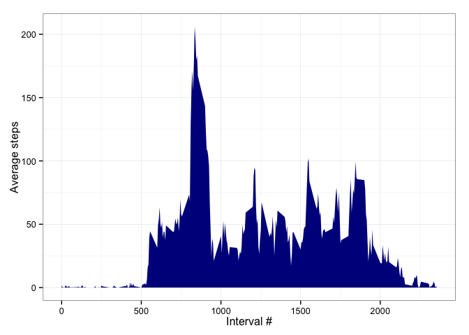
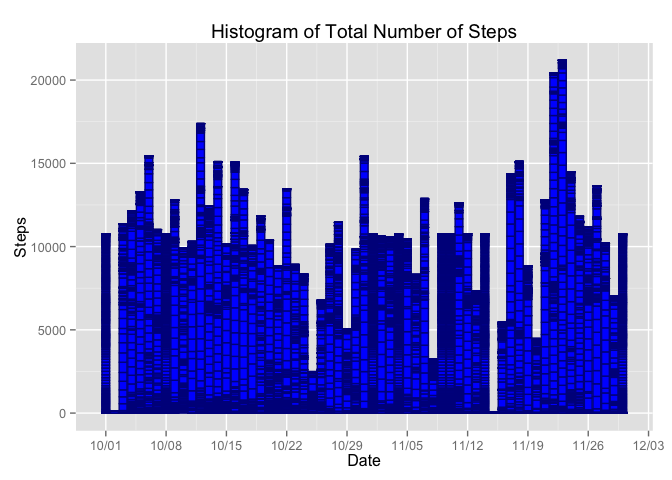
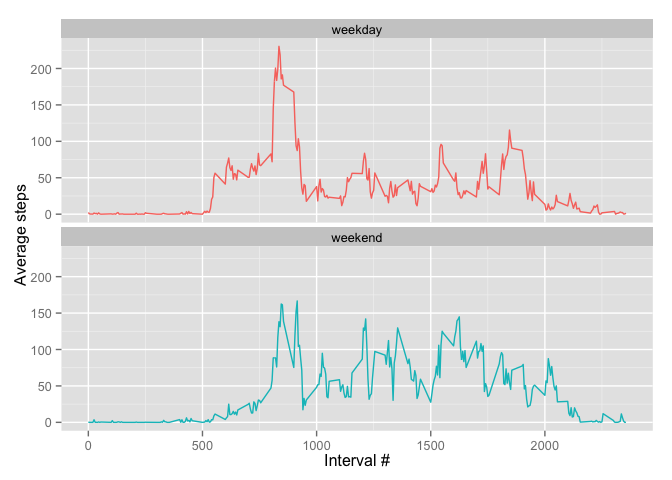

# Reproducible Research: Peer Assessment 1
MiRo  
15 Jul 2015  
## Some preparations

Load packages

```r
packages <- c("data.table", "ggplot2", "dplyr", "scales")
sapply(packages, require, character.only=TRUE, quietly=TRUE)
```

## Loading and preprocessing the data

Read the CSV file.
Convert the data frame to a data table.

```r
dataFilePath <- paste(getwd(), "/activity.csv", sep="")

dt <- data.table(read.csv(dataFilePath))

dt <- dt %>% mutate(date = as.Date(date))
setkey(dt, date, interval)
```

## What is mean total number of steps taken per day?
> 1. Make a histogram of the total number of steps taken each day
> 
> 2. Calculate and report the **mean** and **median** total number of steps taken per day


```r
dailyData <- dt %>% group_by(date) %>% summarise(sumSteps = sum(steps))

meanSteps <- round(mean(dailyData$sumSteps, na.rm = T),2)
medianSteps <- round(median(dailyData$sumSteps, na.rm = T),2)
```

The mean of total number steps per day is 1.076619\times 10^{4} while median is 1.0765\times 10^{4}

What the data looks like?

```r
ggplot(dailyData, aes(x=sumSteps)) + geom_histogram(binwidth=400, fill = "darkblue") + theme_bw() +xlab("Date") + ylab("Steps") 
```

 


## What is the average daily activity pattern?
> 1. Make a time series plot (i.e. `type = "l"`) of the 5-minute interval (x-axis) and the average number of steps taken, averaged across all days (y-axis)
> 
> 2. Which 5-minute interval, on average across all the days in the dataset, contains the maximum number of steps?

Aggregate the average number of steps taken by 5-minute interval.

```r
dataGroupedByIntervals <- dt %>% group_by(interval) %>% summarise(aveSteps = mean(steps, na.rm = T))

bestInterval <- dataGroupedByIntervals %>% filter(aveSteps == max(dataGroupedByIntervals$aveSteps))
```
Interval contains maximun of average steps is 835

Visualise data.

```r
ggplot(dataGroupedByIntervals, aes(x=interval, y=aveSteps)) + geom_area(fill="darkblue") + theme_bw() + xlab("Interval #") + ylab("Average steps")
```

 

## Imputing missing values
> 1. Calculate and report the total number of missing values in the dataset (i.e. the total number of rows with `NA`s)
> 
> 2. Devise a strategy for filling in all of the missing values in the dataset. The strategy does not need to be sophisticated. For example, you could use the mean/median for that day, or the mean for that 5-minute interval, etc.
> 
> 3. Create a new dataset that is equal to the original dataset but with the missing data filled in.
> 
> 4. Make a histogram of the total number of steps taken each day and Calculate and report the **mean** and **median** total number of steps taken per day. Do these values differ from the estimates from the first part of the assignment? What is the impact of imputing missing data on the estimates of the total daily number of steps?

As we know there are a lot of NA in our raw dataset. Actually 0. Let's fix it by using mean for that 5-minute interval to fill each NA value in the steps column.


```r
fixedDt <- dt
for (i in 1:nrow(fixedDt)) {
    if (is.na(fixedDt$steps[i])) {
        fixedDt$steps[i] <- dataGroupedByIntervals[which(fixedDt$interval[i] == dataGroupedByIntervals$interval), ]$aveSteps
    }
}
sum(is.na(fixedDt))
```

```
## [1] 0
```

Here the result.

```r
ggplot(fixedDt, aes(date, steps)) + geom_bar(stat = "identity",
                                             colour = "darkblue",
                                             fill = "blue") + labs(title = "Histogram of Total Number of Steps", x = "Date", y = "Steps") + scale_x_date(labels = date_format("%m/%d"), breaks = "week")
```

 


### Are there differences in activity patterns between weekdays and weekends?

> 1. Create a new factor variable in the dataset with two levels -- "weekday" and "weekend" indicating whether a given date is a weekday or weekend day.
> 
> 2. Make a panel plot containing a time series plot (i.e. `type = "l"`) of the 5-minute interval (x-axis) and the average number of steps taken, averaged across all weekday days or weekend days (y-axis). The plot should look something like the following, which was creating using **simulated data**:


```r
fixedDt$weekdays <- factor(format(fixedDt$date, "%A"))
levels(fixedDt$weekdays)
```

```
## [1] "воскресенье" "вторник"     "понедельник" "пятница"     "среда"      
## [6] "суббота"     "четверг"
```

```r
levels(fixedDt$weekdays) <- list(weekday = c("понедельник", "вторник",
                                             "среда", 
                                             "четверг", "пятница"),
                                 weekend = c("суббота", "воскресенье"))
avgSteps <- aggregate(fixedDt$steps, 
                      list(interval = as.numeric(as.character(fixedDt$interval)), 
                           weekdays = fixedDt$weekdays),
                      FUN = "mean")
names(avgSteps)[3] <- "meanOfSteps"
```


Plot two time series of the 5-minute intervals.


```r
ggplot(avgSteps, aes(x=interval, y=meanOfSteps, color=weekdays)) + geom_line() + facet_wrap(~ weekdays, nrow=2) +	theme(legend.position="none") + xlab("Interval #") + ylab("Average steps")
```

 
