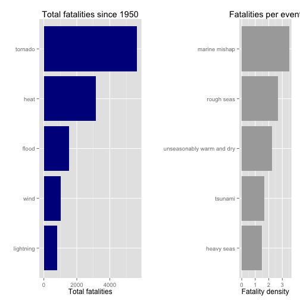
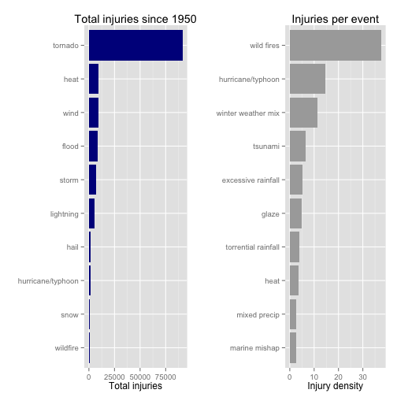
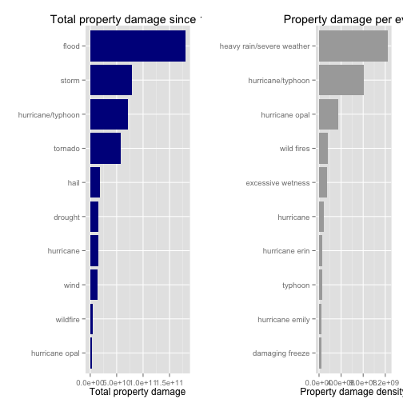

# Storms 

Storms and other severe weather events can cause both public health and economic problems for communities and municipalities. Many severe events can result in fatalities, injuries, and property damage, and preventing such outcomes to the extent possible is a key concern.

This project involves exploring the U.S. National Oceanic and Atmospheric Administration's (NOAA) storm database. This database tracks characteristics of major storms and weather events in the United States, including when and where they occur, as well as estimates of any fatalities, injuries, and property damage.

# Quick summary  
In this report, we aim to analyze the impact of different weather events on public health and economy based on the storm database collected from the U.S. National Oceanic and Atmospheric Administration's (NOAA) from 1950 - 2011. We will use the estimates of fatalities, injuries, property and crop damage to decide which types of event are most harmful to the population health and economy. 
From these data, we found that tornado and heat are most harmful with respect to population health, while water events are the most fatalities densitive. 
Flood, storm, hurricane have the greatest economic consequences.

##Loading requirements and data.


*Across the United States, which types of events (as indicated in the EVTYPE variable) are most harmful with respect to population health?

*Across the United States, which types of events have the greatest economic consequences?

Harmness of population health would be a measure of fatalities and injures have been made during events.

##Data processing sectoin


```r
mainNotExplTypes <- c("thunderstorm", "tornado", "flood", "snow", "wind", "cold", "surf", "storm", "heat", "rip")

getCost <- function(numV, charV){
  mult <- rep(1, length(charV))
  for (i in 1:length(charV)) {
    mult[i] <- switch (charV[i],
      k = 10^3,
      m = 10^6,
      b = 10^9,
      1
    )
  }
  res <- numV * mult
  res
}

#getCost(c(1,2,4), c("k", "", "0"))

harmDt <- dt %>% select(bgn_date, evtype, fatalities, injuries, propdmg, propdmgexp, cropdmg, cropdmgexp) %>% mutate(date = as.Date(bgn_date, format="%m/%d/%Y"), evtype = as.factor(evtype), propdmgexp = tolower(propdmgexp), cropdmgexp = tolower(cropdmgexp), dmg = getCost(propdmg, propdmgexp)+getCost(cropdmg, cropdmgexp)) %>% select(-bgn_date)

#summary(harmDt)
```

##Results
###Top total fatalities during last 64 years.
 

###Top total injures during last 64 years.
 

###Top economics damage reasons for last 64 years.
 
