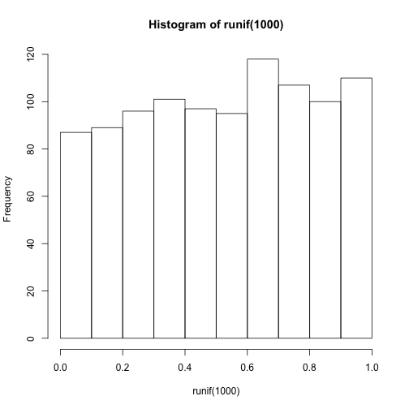
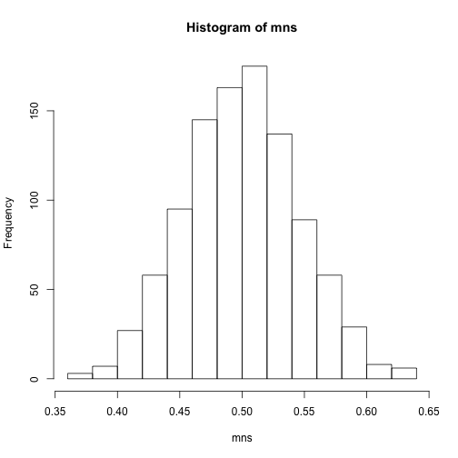
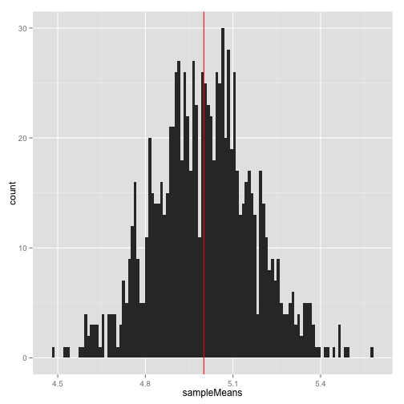

## Overview

## Main question
Illustrate via simulation and associated explanatory text the properties of the distribution of the mean of 40 exponentials.  You should
1. Show the sample mean and compare it to the theoretical mean of the distribution.
2. Show how variable the sample is (via variance) and compare it to the theoretical variance of the distribution.
3. Show that the distribution is approximately normal.

##Loading requirements and data.

```
##       data.table     ggplot2        dplyr          scales        
##  [1,] "knitr"        "knitr"        "knitr"        "knitr"       
##  [2,] "gridExtra"    "gridExtra"    "gridExtra"    "gridExtra"   
##  [3,] "grid"         "grid"         "grid"         "grid"        
##  [4,] "vwr"          "vwr"          "vwr"          "vwr"         
##  [5,] "latticeExtra" "latticeExtra" "latticeExtra" "latticeExtra"
##  [6,] "RColorBrewer" "RColorBrewer" "RColorBrewer" "RColorBrewer"
##  [7,] "lattice"      "lattice"      "lattice"      "lattice"     
##  [8,] "stringdist"   "stringdist"   "stringdist"   "stringdist"  
##  [9,] "scales"       "scales"       "scales"       "scales"      
## [10,] "dplyr"        "dplyr"        "dplyr"        "dplyr"       
## [11,] "ggplot2"      "ggplot2"      "ggplot2"      "ggplot2"     
## [12,] "data.table"   "data.table"   "data.table"   "data.table"  
## [13,] "stats"        "stats"        "stats"        "stats"       
## [14,] "graphics"     "graphics"     "graphics"     "graphics"    
## [15,] "grDevices"    "grDevices"    "grDevices"    "grDevices"   
## [16,] "utils"        "utils"        "utils"        "utils"       
## [17,] "datasets"     "datasets"     "datasets"     "datasets"    
## [18,] "methods"      "methods"      "methods"      "methods"     
## [19,] "base"         "base"         "base"         "base"        
##       vwr            gridExtra     
##  [1,] "knitr"        "knitr"       
##  [2,] "gridExtra"    "gridExtra"   
##  [3,] "grid"         "grid"        
##  [4,] "vwr"          "vwr"         
##  [5,] "latticeExtra" "latticeExtra"
##  [6,] "RColorBrewer" "RColorBrewer"
##  [7,] "lattice"      "lattice"     
##  [8,] "stringdist"   "stringdist"  
##  [9,] "scales"       "scales"      
## [10,] "dplyr"        "dplyr"       
## [11,] "ggplot2"      "ggplot2"     
## [12,] "data.table"   "data.table"  
## [13,] "stats"        "stats"       
## [14,] "graphics"     "graphics"    
## [15,] "grDevices"    "grDevices"   
## [16,] "utils"        "utils"       
## [17,] "datasets"     "datasets"    
## [18,] "methods"      "methods"     
## [19,] "base"         "base"
```

  

## Simulations

We are about to simulate 1000 tests with n=1000 of exponential distribution

```r
testsN <- 1000
n <- 1000
# The mean of exponential distribution is 1/lambda and the standard deviation is also 1/lambda
lambda <- 0.2

meanTested <- 1/lambda
sdTested <- 1/lambda
alpha <- 0.05

sampleMeans <- c()
sampleSDs <- c()

for(i in 1:testsN){
  sample <- rexp(n, lambda)
  sampleMeans <- c(sampleMeans, mean(sample))
  sampleSDs <- c(sampleSDs, sd(sample))
}
```

## Sample Mean versus Theoretical Mean


```r
xfit <- seq(min(sampleMeans), max(sampleMeans), length=testsN)
yfit <- dnorm(xfit, mean=1/lambda, sd=(1/lambda/sqrt(n)))

gplot <- ggplot(as.data.frame(x=sampleMeans),aes(sampleMeans)) + geom_histogram(binwidth = 1/(testsN/10)) + labs(main = "Distribution of averages of samples, lambda=0.2",ylab ="Count", xlab = "Observed means") + geom_vline(xintercept = 1/lambda, col="red")

gplot
```

```
## Warning: position_stack requires constant width: output may be incorrect
```

 

```r
meanMeans <- mean(sampleMeans)
meanSDs <- mean(sampleSDs)
sdMeans <- sd(sampleMeans)
```
Theoretical mean is equal to 5. Let's test our example mean (5.0020581) with t test.
Standart deviation of sample means is equal to 0.1686945 where the theoretical standart deviation of the distribution is $\sigma^2 / n = 1/(\lambda^2 n) = 1/(0.04 \times 40)$ = 0.625.

Due to the central limit theorem, the averages of samples follow normal distribution. 

```r
lambda <- seq(4, 6, by=0.01)
coverage <- sapply(lambda_vals, function(lamb) {
    mu_hats <- rowMeans(matrix(rexp(sample_size*num_sim, rate=0.2),
                               num_sim, sample_size))
    ll <- mu_hats - qnorm(0.975) * sqrt(1/lambda**2/sample_size)
    ul <- mu_hats + qnorm(0.975) * sqrt(1/lambda**2/sample_size)
    mean(ll < lamb & ul > lamb)
})
```

```
## Error in lapply(X = X, FUN = FUN, ...): объект 'lambda_vals' не найден
```

```r
qplot(lambda_vals, coverage) + geom_hline(yintercept=0.95)
```

```
## Error in eval(expr, envir, enclos): объект 'lambda_vals' не найден
```

## Sample Variance versus Theoretical Variance


## Distribution


