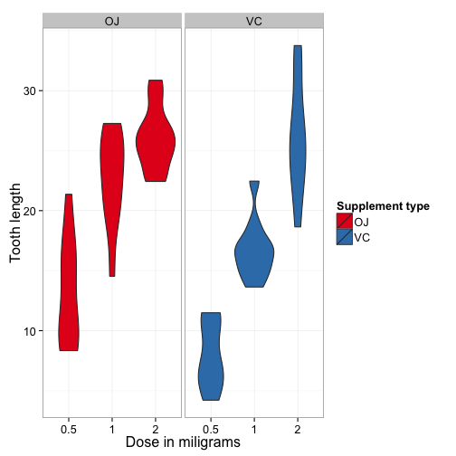
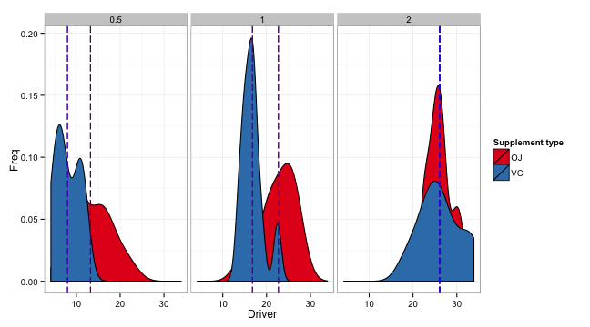

## Overview
\newthought{The ToothGrowth data}[^dataset] consists of measurements of the mean length of the odontoblast cells harvested from 60 guinea pigs. These animals were fed a diet of 6 Vitamin C supplements. The Vitamin C was administered either in the form of Orange Juice (OJ) or chemically pure Vitamin C (VC). Each animal received the same daily dosage of Vitamin C
consistently.

This study performs an exploration of this data. The goal of the exploration is to see if we
can reasonably infer that either the method of administering vitamin C or the dosage has an
impact on the size of odontoblast cells.


## Loading and preparing data
For starters, let's run a summary of ToothGrowth to see what the contents of the dataset
are.

And true to the data description, we can see that there are 60 observations with two
supplements and three dosages.

From this quick analysis we can determine that there are two qualitative variables, the
supplement and dosage (supp and dose). And there is one quantitative variable; len.
Finally, let's compute some descriptive statistics on the quantitative variable.


## Data discovery
Plotting ToothGrowth data to have a quick overview.
 
Since intervals are not intersect, we could say that there are singificant difference 
in tooth lenth depends on dosage. We could even build a linear model to discribe this 
dependence, but not there is no need to do it for that assessment.

## Testing delivery methods
Now our aim is to test how tooth lenght depends on dosage and delivery method.
Is there any significant difference between these methods?
For every dosage t-test has been done there.
 


```
## [1] "p-Value for dosage 0.5 equals to 0.01."
## [1] "p-Value for dosage 1 equals to 0."
## [1] "p-Value for dosage 2 equals to 0.96."
```


As we might see, for dosages 0.5 and 1 there are 95% significant difference in resulting tooth lenth. 

[^dataset]: Source: C. I. Bliss (1952) The Statistics of Bioassay. Academic Press.
